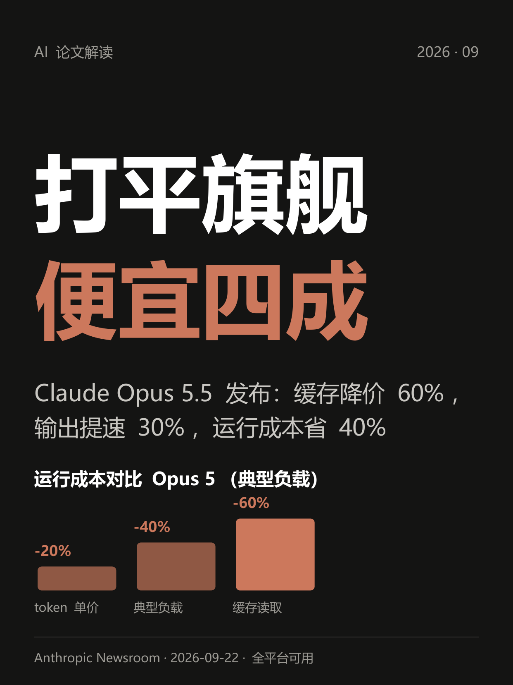
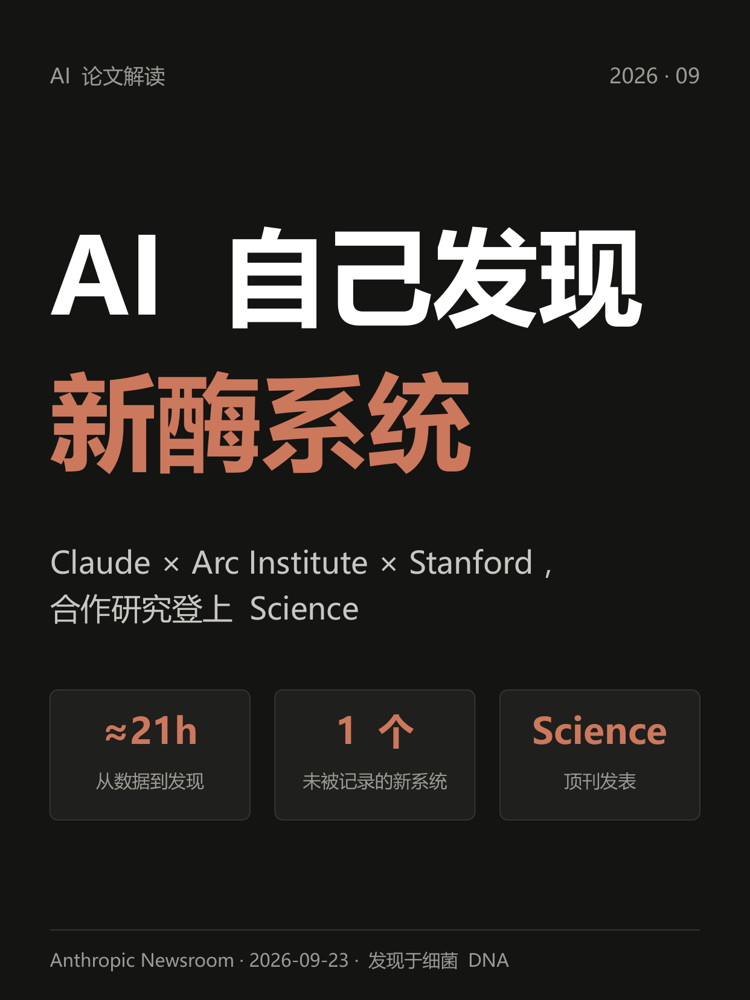

# ai-paper-to-xhs

一套跑在 [ZCode](https://zcode.ai)（或同类 AI 编码助手）里的内容生产流水线：**把 AI 论文和厂商博客，变成可发布的小红书笔记**。

> 设计目标：AI 负责采集、解读、成稿、做图；人负责事实终审与发布。学术内容翻车成本高，终审关卡永远保留。

## 流水线

```
采集(论文/博客) → 候选入台账 → 自动选题 → 深读原文+事实核对清单
→ 按模板成稿 → 去AI味(8遍工序) → 字数实测 → 3:4卡片(pptx→PNG)
→ 版式验收 → 台账回填 → 人工终审 → 发布
```

## 特性

- **事实核对清单**：正文每条陈述对应原文出处，区分「论文事实 / 解读观点 / 人设表述」，发布前人工过一遍
- **去 AI 味工序**：内置 humanize-writing 的 8 遍编辑流程 + 中文 AI 味词表，装腔开场/说教金句/段段 emoji 出现即重写
- **字数硬约束实测**：标题 ≤20 字、正文含标签 ≤1000 字，脚本自动统计
- **3:4 卡片生成**：pptxgenjs 画卡片 → LibreOffice 转 PDF → PyMuPDF 渲染 1242×1656 PNG；accent 跟随选题方品牌色
- **可复现迁移**：三个脚本搞定新机器部署（环境自检 / 工作区初始化 / 打包导出）

## 快速开始

```bash
# 1) 环境自检（列出缺失依赖与安装命令）
python skill/scripts/setup_env.py --fix

# 2) 初始化工作区（生成 sources.md、templates/、topics.xlsx、weekly/、posts/，并安装 skill）
python skill/scripts/bootstrap_workspace.py <你的工作区路径>

# 3) 在 ZCode 中打开工作区，说「跑今天」「跑最近一周」或「解读这篇 + <链接>」
```

依赖：Python ≥3.9（openpyxl / PyMuPDF / python-pptx）、Node.js（全局 pptxgenjs）、LibreOffice（渲染 PNG 用）、ZCode 内置工具（web_reader / browser-use / WebSearch）。详见 `skill/scripts/setup_env.py` 的输出。

## 成品展示

三次真实运行（2026-W39）的完整产出——正文、事实核对清单、三张卡片全部开源，可直接对照流水线各环节的产物形态：

| 让 AI 自己出题自己判卷 | Claude Opus 5.5 发布 | AI 自主科学发现 |
|:---:|:---:|:---:|
| [](examples/2026-W39/2026-09-26-CodeMidas/正文.md) | [](examples/2026-W39/2026-09-26-Opus5.5/正文.md) | [](examples/2026-W39/2026-09-26-Claude酶发现/正文.md) |
| 小米：只用源代码让 AI 自动造编程训练题库 | Anthropic：能力打平旗舰，价格降四成 | Claude 发现新酶系统，登上 Science |
| [完整笔记](examples/2026-W39/2026-09-26-CodeMidas/正文.md) · [事实核对](examples/2026-W39/2026-09-26-CodeMidas/事实核对.md) | [完整笔记](examples/2026-W39/2026-09-26-Opus5.5/正文.md) · [事实核对](examples/2026-W39/2026-09-26-Opus5.5/事实核对.md) | [完整笔记](examples/2026-W39/2026-09-26-Claude酶发现/正文.md) · [事实核对](examples/2026-W39/2026-09-26-Claude酶发现/事实核对.md) |

每个示例目录含：`正文.md`（成稿）、`事实核对.md`（逐条溯源清单）、`封面卡/内容卡1/内容卡2.png`（1242×1656）、`卡片.js`（该期卡片的生成脚本）。

**完整存档**：`posts/` 下按周归档全部成稿（当前 8 篇，2026-W39 ~ W40），`weekly/` 为每周采集原材料与采集日志，`topics.xlsx` 为选题与数据台账——三者构成完整的运行存档。

## 目录结构

```
skill/                    jiedu-lunwen 主 skill
├── SKILL.md              全流程编排（按需触发、采集窗口、产能规则）
├── references/卡片规范.md  卡片设计系统（版式骨架、调色板、渲染链）
├── references/中文AI味清单.md  中文去 AI 味词表
├── references/对标打法.md  对标博主技法卡（成稿自查用）
├── assets/卡片模板.js     卡片骨架（改内容不改骨架）
└── scripts/              setup_env / bootstrap_workspace / export_bundle / render_cards / count_body
humanize-writing/         第三方去 AI 味 skill（MIT，见致谢）
workspace-template/       新工作区种子（sources.md 信息源与规则手册、小红书笔记模板）
posts/                    成品存档（按周归档，全部已发布）
weekly/                   每周采集原材料与日志
topics.xlsx               选题与发布数据台账
```

## 设计原则

1. **事实红线**：引号里的数字必须能在原文中指出位置，找不到就不写
2. **人机分工**：AI 产出停在「待终审」；终审与发布永远由人完成
3. **栏目化与体例**：固定栏目角标（不带期数）、正文骨架、标题写法，均写在模板与规范里，改一处全局生效
4. **文本即状态**：所有流程状态都在 md/xlsx 文件里，换机器、换会话不丢上下文

## 致谢

- [humanize-writing](https://github.com/jpeggdev/humanize-writing)（MIT）——8 遍去 AI 味编辑工序，整合自 [blader/humanizer](https://github.com/blader/humanizer) 与 [Wikipedia: Signs of AI writing](https://en.wikipedia.org/wiki/Wikipedia:Signs_of_AI_writing)

## License

[MIT](LICENSE) © 2026 lckksk；`humanize-writing/` 目录遵循其原仓库 MIT 许可。
